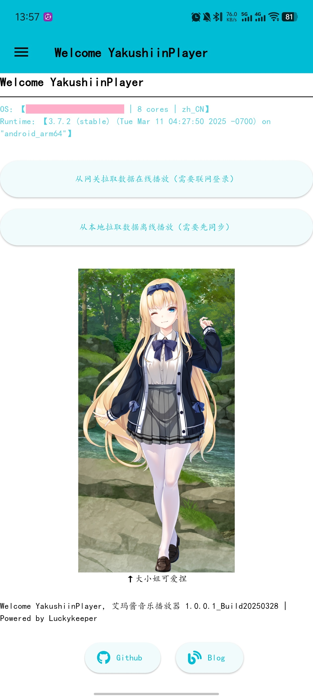
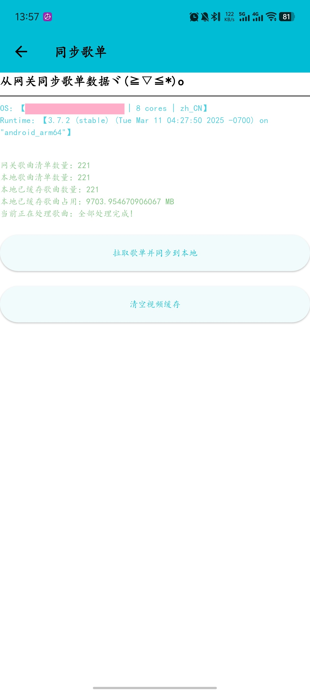
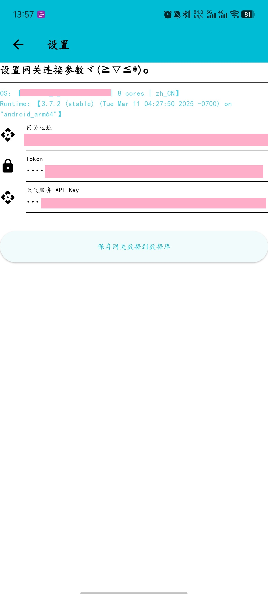
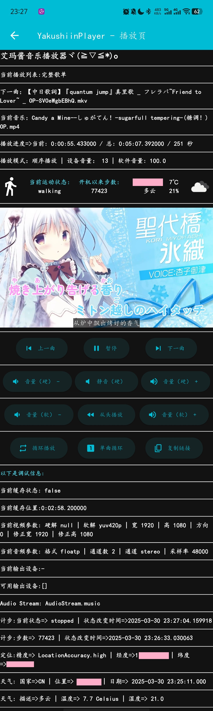

# YakushiinPlayer

艾玛酱跨平台视频播放器，用于日常听歌，支持播放列表，支持外挂字幕，可缓存到本机或在线播放，可记忆上次播放位置，获取运动状态和步数，获取当前位置天气状态，主题自适应系统深色模式开启/关闭。[luckykeeper/OAPlayer](https://github.com/luckykeeper/OAPlayer) 续作~

## 预览

| 首页                                                         | 同步页                                                       |
| ------------------------------------------------------------ | ------------------------------------------------------------ |
|  |  |
| 设置页                                                       | 播放页                                                       |
|  |  |

## 使用

和 [luckykeeper/OAPlayer](https://github.com/luckykeeper/OAPlayer) 一样，仍然需要自行实现后端（以及管理工具），后端和管理工具暂不开源，后端网关名字叫 [NoaHandler](https://blog.cocoa.xin/article/71/#架构设计) ，使用者需要自行实现该网关的部分功能（音乐管理模块），具体需要实现的部分介绍如下

只需要实现如下一个接口即可

### 接口

#### 1、请求数据（YakushiinPlayer 侧向 NoaHandler 发送）

设置页填写该接口完整地址，带协议，设置页第二项 token 即为请求本接口的 token

**请求方式**：`POST`

**接口定义**：（Go）

```go
type AppRequest struct {
	Token         string                `json:"token"`
}
```

**请求示例**：（Json）

```json
{
    "token": "xxxxxx"
}
```

#### 2、返回数据（NoaHandler  侧向 YakushiinPlayer 返回）

**接口定义**：（Go）

> 如果你和我一样喜欢用 xorm ，直接复制即可自动建表
>
> 在 `NoaPlayerV2Music` 里面，字幕相关的四个字段可空

```go
type NoaPlayerV2Msg struct {
	Token         string                `json:"token"`
	StatusCode    int                   `json:"statusCode"`
	StatusMessage string                `json:"statusMessage"`
	PlayList      []NoaPlayerV2PlayList `json:"playList"`
}

type NoaPlayerV2Music struct {
	ID            uint64 `json:"id" xorm:"pk autoincr 'id' comment('ID')"`
	PlayListID    uint64 `json:"playListID" xorm:"'playListID' comment('播放列表ID')"`
	VideoName     string `json:"videoName" xorm:"TEXT 'videoName' comment('视频名称')"`
	VideoUrl      string `json:"videoUrl" xorm:"TEXT 'videoUrl' comment('视频链接')"`
	VideoShareUrl string `json:"videoShareUrl" xorm:"TEXT 'videoShareUrl' comment('视频分享链接')"`
	VideoMd5      string `json:"videoMd5" xorm:"TEXT 'videoMd5' comment('文件MD5')"`
	SubTitleName  string `json:"subTitleName" xorm:"TEXT 'subTitleName' comment('字幕名称')"`
	SubTitleUrl   string `json:"subTitleUrl" xorm:"TEXT 'subTitleUrl' comment('字幕链接')"`
	SubTitleLang  string `json:"subTitleLang" xorm:"TEXT 'subTitleLang' comment('字幕语言')"`
	SubTitleMd5   string `json:"subTitleMd5" xorm:"TEXT 'subTitleMd5' comment('字幕MD5')"`
}

type NoaPlayerV2PlayList struct {
	ID           uint64             `json:"id" xorm:"pk autoincr 'id' comment('ID')"`
	PlayListName string             `json:"playListName" xorm:"TEXT 'playListName' comment('播放列表名称')"`
	MusicList    []NoaPlayerV2Music `json:"musicList" xorm:"-"`
}

```

**返回示例**：（Json）

**注意：由于 `HiveObject` 原因，`playList` 播放列表只能放一个，不能放多个播放列表，否则播放时会有问题，后面的版本有时间我想想办法处理下**

`musicList` 里面的 `playListID` 与 `playList` 下的 `id` 对应

正常情况下，接口的 HTTP 状态码应该一律返回 200 ，依赖返回 Json 内的 `statusCode` 和 `statusMessage` 判断返回是否正常

在异常情况下，接口的 HTTP 状态码仍然应该返回 200，你需要把错误码和错误原因返回到 `statusCode` 和 `statusMessage`

```json
{
    "token": "",
    "statusCode": 200,
    "statusMessage": "获取播放列表 V2 成功!",
    "playList": [
        {
            "id": 1,
            "playListName": "我是歌单名称",
            "musicList": [
                {
                    "id": 1,
                    "playListID": 1,
                    "videoName": "我是歌曲名称",
                    "videoUrl": "我是视频下载链接",
                    "videoShareUrl": "我是视频分享链接",
                    "videoMd5": "我是视频文件 md5 值",
                    "subTitleName": "我是字幕文件标题",
                    "subTitleUrl": "我是字幕文件下载链接",
                    "subTitleLang": "我是字幕文件语言（示例：cn）",
                    "subTitleMd5": "我是字幕文件 md5 值"
                },
                {
                    "id": 2,
                    "playListID": 1,
                    "videoName": "我是歌曲名称",
                    "videoUrl": "我是视频下载链接",
                    "videoShareUrl": "我是视频分享链接",
                    "videoMd5": "我是视频文件 md5 值",
                    "subTitleName": "我是字幕文件标题",
                    "subTitleUrl": "我是字幕文件下载链接",
                    "subTitleLang": "我是字幕文件语言（示例：cn）",
                    "subTitleMd5": "我是字幕文件 md5 值"
                }
            ]
        }
    ]
}
```

### 天气 API

如果你需要正常使用天气功能，你将需要注册一个 [OpenWeatherMap](https://openweathermap.org/) 的账号并生成一个 API Key，填入设置页面

每个账号每天可以免费请求 1000 次，本程序在能获取定位信息时，每 30 分钟会根据实时定位更新一次天气数据

这个 API Key 在设置里面非必填项，不填的话就不会显示天气相关信息

## 常见问题

> 由于作者没有苹果生态设备，所以无法进行调试，如果有 iOS 和 MacOS 需求，请自行打包，遇到问题也请自己处理，这里先说句抱歉喵
>
> 项目在 Windows Server 2022 Datacenter 和 vivo Android 15 已经自测

### 1、没有显示步数信息或当前活动状态未知（Android）？

对应用授权获取身体活动权限

### 2、没有获取到天气信息（Android）？

对应用授权定位权限，并填写天气 API Key

### 3、反馈问题时，如何提供日志 & 下载完成的文件去了哪里？

- 如果是 PC 端（Windows / Linux / MacOS），日志有文件将会保存在当前运行目录下

```bash
# dir
#   --[dir]  music           # <= 下载完成的歌曲文件和字幕文件，名称为其 md5 值
#   --[dir]  dataEngine      # <= Hive 数据库
#   --[file] yakushiinLogger # <= yakushiinLogger.log 日志文件
```

- 如果是 Android

在应用的外部存储文件夹

```bash
# /Android/data/luckykeeper.site.yakushiin_player/files
#   --[dir]  music           # <= 下载完成的歌曲文件和字幕文件，名称为其 md5 值
#   --[dir]  dataEngine      # <= Hive 数据库
#   --[file] yakushiinLogger # <= yakushiinLogger.log 日志文件
```

- 其他端（iOS）

在应用自己的 Document 文件夹下

### 4、最低支持的安卓版本

最低 SDK 版本 21 (Android 5)

目标 SDK 版本 35 (Android 15)

NDK 版本 27      (Android 8.1)

## 其他

大小姐可爱捏~


